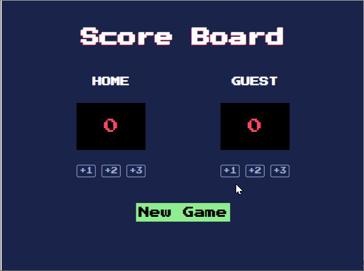

# **Basketball Scoreboard**

# Overview

Welcome to the Basketball Scoreboard! 🏀 This project is a simple scoreboard that calculates and displays scores for both home and guest teams. Users can increment the scores by 1, 2, or 3 points for each home and guest. Additionally, there is a "New Game" button that resets the scores for both the home and guest teams.

# Website

Live Version [here](https://scoreboard03.netlify.app/)

# Preview

## What I've Learned

This project has provided practical experience in manipulating the DOM and dynamically updating text content. Key learnings include:

- **DOM Manipulation**: Understanding how to manipulate the DOM to update scores and reset the scoreboard.

- **Incrementing Text on the DOM**: Implementing functionality to increment scores by 1, 2, or 3 points for both home and guest teams.

## Getting Started

Explore the Unit Converter by following these steps:

1. Clone the repository.
2. Open the index.html file in your browser.
3. Click the buttons to increment scores for the home and guest teams.
4. Use the "New Game" button to reset scores for both teams.

## Features

- **Simple Score Display**: Clearly displays scores for both home and guest teams.

- **Increment Scores**: Click buttons to increment scores by 1, 2, or 3 points for each home and guest.

- **New Game Button**: Easily reset scores for both home and guest teams with the "New Game" button.

# Author

Komal | Software Developer | [Portfolio](https://kaurkomal.com/) | [LinkedIn](https://www.linkedin.com/in/hssa03/)